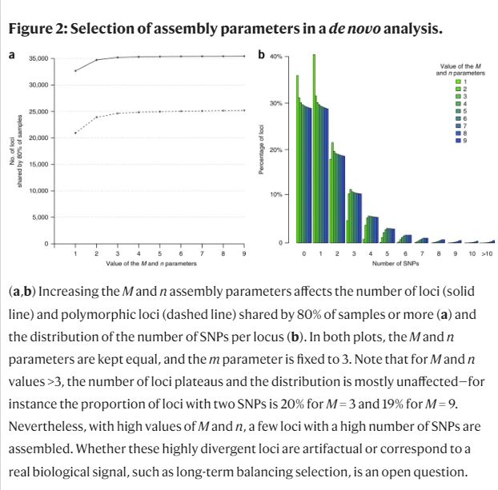
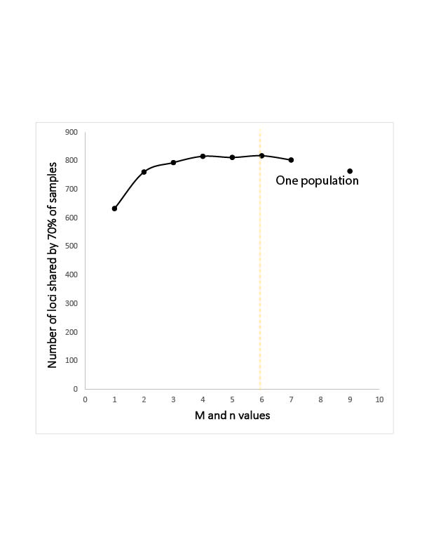
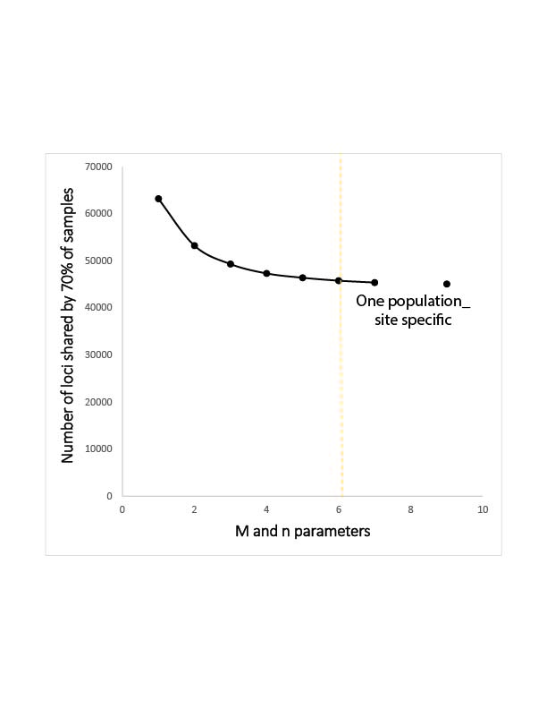
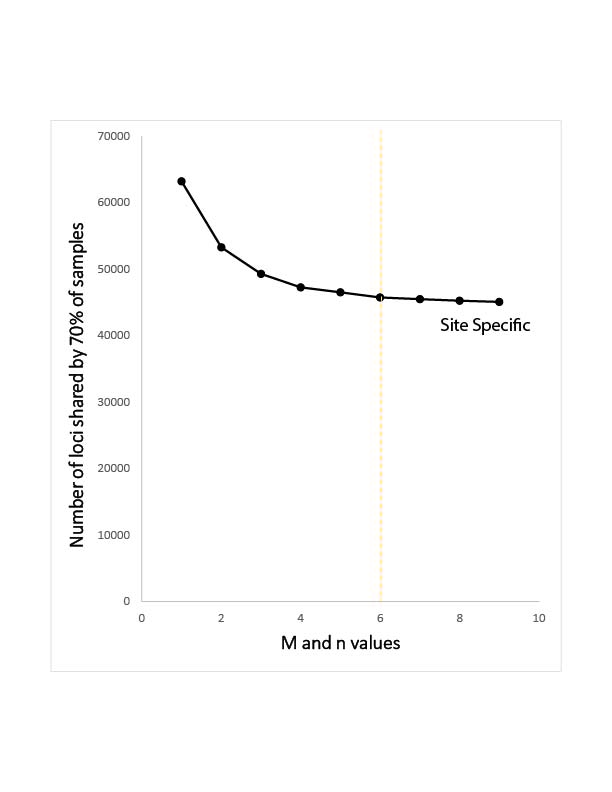

# BIOL:4386 Course Project - Reproducing *Deriving genotypes from RAD-seq short-read data using Stacks* with genomic data from moth *Schinia gracilenta*
## Project Homework 3- April 6 2023

## Reference Paper for Figure
Rochette, N., Catchen, J. Deriving genotypes from RAD-seq short-read data using Stacks. Nat Protoc 12, 2640–2659 (2017). https://doi.org/10.1038/nprot.2017.123

## Introduction - Specifically for Scientific Computing Semester Project 
When one species depends on another for survival, the two species may have shared demographic histories to the extent that studying a symbiont might tell us about its host. When genetic capabilities are limited for studying the host directly, the study of a symbiont may provide a necessary workaround to ask broad questions regarding the biotic and abiotic factors that influence the evolutionary and demographic histories of organisms (Hoberg et al 2001; Kim and Sappington 2013; Lόpez-Uribe et al 2016; Moodley et al 2021; Toups et al 2011). 

In the slender flower moth *(Schinia gracilenta)* and its host plant, sumpweed *(Iva annua)*, I utilize this strategy to address existing uncertainties about sumpweed as an early domesticated crop plant in North America. Sumpweed is thought to have been cultivated in North American ca. 5000 BC - AD 1700 and its range may have been expanded during this time, though few archaeobotanical records exist to support or reject a range expansion (Fritz 1993; Smith 1989; Zeanah 2017). I collected *Schinia gracilenta*, *Schinia rivulosa* and *Schinia thoreaui* feeding on *Iva annua*, *Iva frutescens*, *Ambrosia artemisiifolia* and *Ambrosia trifida* across the eastern half of what is now the USA. I used Restriction-site Associated DNA sequencing (RAD-seq) to test whether the *S. gracilenta* genomes contain signatures of a possible human-mediated *I. annua* range expansion. I generated a phylogenetic tree of the collection using the RAD-seq data and subsampled collections to make a secondary mitochondrial COI gene tree. Using population genetics methodologies, I determined the population structure of all Schinia collections from all host plants. Then, in a restricted analysis that includes only *S. gracilenta*, I, again, looked at the population structure in addition to several population genetics metrics of population diversity. 

I utilized RAD sequencing because it **provides efficient and flexible markers for population genetic analysis of non-model organisms with no published reference genome** (Bayona-Vasquez et al., 2019, Eaton & Overcast, 2020). RAD sequencing produces whole locus and SNP datasets. 

Use of restriction-site associated DNA sequencing (RAD seq) has increasingly been utilized to genotype populations without non-model organisms as a tool for population genetics analysis. To produce a reliable set of loci for downstream analysis, understanding of bioinformatic programs such as Stacks is necessary. 

**Stacks is a software pipeline for building loci from short-read sequences**, such as those generated on the Illumina sequencing results. Stacks was specifically built to work with restriction-enzyme based data, such as RAD-seq, in order to build genetic maps and conduct population genomics and phylogeography. 

There are three main steps within the Stacks pipeline that control the *de novo* assemble of loci. I chose the *de novo* assembly for my dataset because *Schinia gracilenta* does **NOT** have a published reference genome. Each step within the *de novo* assembly has an assigned parameter that controlls how the data is filtered for that step. There are default values for these parameters, however, it is recommended to test what your data looks like for each parameter in order to determine how the data fits the program for best analysis. 

#### Step 1: Assemble of alleles WITHIN each individual, controlled by parameter -m. Parameter -m stands for the minimum stack depth parameter and controls the number of raw reads required to faorm an initial stack. For example, if the -m is set to the default value of -m = 3, this means that if there is a stack with only two alleles, then that stack will be removed from any downstream analyses. 
- If -m is set too LOW- reads with similar sequencing errors are likely to be accidentally labeled as alleles. 
- If -m is set too HIGH- true alleles will not be recorded and will drop out of anlysis. 

#### Step 2: Assemble loci WITHIN each individual, controlled by parameter -M. Parameter -M stands for the distance allowed between stacks, and represents the number of nucleotides that may be different between two stacks to merge them. For example, if -M is set to the default value, -M = 2, this means that from the stacks created in Step 1, if there are fewer than 2 nucleotide mismatches, then they will be merged into one locus. 
- If -M is set too LOW- some loci will fail to be reconstructed. SNPs will appear as two different loci fro the rest of the pipeline. 
- If -M is set too HIGH- different loci with some sequence similarity will be lumped together into the same locus. 

#### Step 3: Make catalog of loci across ALL individuals, controlled by parameter -n. Parameter -n stands for the distance allowed between catalog loci, and represents the number of nucleotide differences loci in individuals can have to be combined into a master locus. This parameter is very similar to parameter -M. What makes them different is that -M is assembling loci WITHIN each individual and -n is assembling loci across ALL individuals. 
- If -n is set too LOW- some loci will fail to be reconstructed. SNPs will appear as two different loci fro the rest of the pipeline. 
- If -n is set too HIGH- different loci with some sequence similarity will be lumped together into the same locus.  

The creators of STACKS recommend that before data analysis is continued, the raw data is run through the *de novo* pipeline multiple times using different parameters. The output of each of the these parameters can be examined for how the different parameters within the program are filtering loci counts. For this project, I reproduced the following figure, specifically looking at **Figure 2a- mapping the number of loci shared by 80% of samples when the values of M and n parameters are varied.** The process to create this figure is important to produce when using the Stacks progam to analyze what parameters will represent my dataset the best. Parameters must be settled before moving on through the rest of the data analysis pipeline. 

## Figure to reproduce **ONLY PART A** 

I chose parameter values by looking at the relationship between the number of loci shared by all samples across values of M and n. I generated nine *de novo* outputs: 
1. M, n = 1
2. M, n = 2
3. M, n = 3
4. M, n = 4
5. M, n = 5
6. M, n = 6
7. M, n = 7
8. M, n = 8
9. M, n = 9

I generated a graph that showed how the number of shared loci changed as M and n increased. The recommended choice of a value for M and n is the smallest number at which the number of shared loci plateaus, or stabilizes (Catchen et al 2017).

**Understanding these parameters and testing which fit the data best are important because they:** 
**1. Make sure true genetic differences are recorded.** 
**2. Help throw out sequencing errors and missing data BEFORE data analysis.**

## Methods 
### 1. Field Collections and Sample Preparation
#### 1a. Sample collection (completed)
*Schinia* moths were collected as adults and as larvae off of the plants *Iva annua*, *Iva frutescens*, *Ambrosia artemisiifolia* and *Ambrosia triifida* across a wide geographic distribution of sites across Eastern North America (Collection map, Collection glossary). I selected collection sites from both within and outside of the range of the Eastern Agricultural Complex. A majority of the collected individuals were seventh instar larvae, picked off host plant cypselae (fruit/seeds) and immediately put into tubes with 95% ethanol. Three adults were also collected on the cypselae of host plants. 

For the purpose of my study I defined “sites” as collection locations more than 1km apart. Some sites were grouped together for specific sets of analyses if they were less than 25km apart (Collection map). I set a goal of collecting 10 individuals per site, but final collections per site ranged from one individual to 30, with a median of seven individuals. There were a total of 315 individuals collected for this study. 

#### 1b. DNA extraction (completed)

I extracted DNA from all 315 moths using a modified CTAB (Cetyltrimethylammonium bromide) and PCI (Phenol/Chloroform/Isoamyl alcohol) extraction protocol based on Chen et al. (2010). Tissue was collected by bisecting larvae longitudinally, removing internal organs, and utilizing roughly half a centimeter of abdomen for extractions. DNA from each individual was quantified using the fluorescence-based Quant-iT PicoGreen HS dsDNA Assay Kit (Invitrogen, Molecular Probes, Eugene, OR). 

#### 1c. 3RAD library preparation and sequencing (completed)
DNA from all 315 moth samples was sequenced using a restriction site associated DNA sequencing protocol (3RAD), a method that provides efficient and flexible markers for population genetic analysis of non-model organisms that do not have a reference genome sequence (Bayona-Vasquez et al., 2019, Eaton & Overcast, 2020). I chose to use 3RAD over other RAD methods because 3RAD removes unwanted dimers, especially when DNA may be of varying quality (Bayona-Vasquez 2019). I grouped samples into sets of up to 96 individuals randomized by location, host plant, and DNA concentration. Sixteen individuals that were determined to be particularly important for successful downstream analyses were duplicated and sequenced in multiple libraries to ensure sequence availability of these critical samples (Duplicated samples). I selected priority samples based on the relative number of individuals collected from each site and the location of the population. For example, site ELP, Elklick Woodlands Natural Area Preserve, was a priority site because I only had six samples total from this site and it was also one of the easternmost sites. I standardized target input DNA to 60 ng per individual. 3RAD sequencing followed the protocol described in Bayona-Vasques et al (2019), using enzymes Xbal, EcoRI, and Nhel (2019). For digestion, DNAs and restriction enzymes were incubated together at 37 C for 1 hour. Following digestion, I ligated uniquely assigned Read 1 and Read 2 adapters with 8-11bp to each sample (Indices and adapters). Conditions favorable to adaptor ligation (20 min at 22 C) were alternately cycled with a secondary digestion (10 min at 37 C) to cleave any unwanted fragments and adapter dimers. Lastly, I heat-killed restriction enzymes at 80 C for 20 min. 

I pooled the samples together, assigned iTru7 indexes to each library of indexed samples, and PCR amplified with 15 rounds of high-fidelity PCR starting with 98 C (2 min) and cycling through 98 C (20 seconds), 60 C (15 seconds), 72 C (30 seconds), 72 C (10 min)  using the KAPA HotStart kit (KAPA HotStart PCR Kit, KAPA Biosystems, Wilmington, Massachusetts, Indices and adapters). A universal iTru5 Illumina index that included eight random nucleotides was also added to each sample. Prepared samples were then pooled together and checked on a 1% agarose gel to ensure digestion and ligation steps were run effectively. Pooled samples were loaded onto a BluePippin (Sage Science, Beverly, MA) to size select for fragments of 550 +/- 50 bp. I checked the fragment size distribution of size selected libraries using the Agilent Model 2100 Bioanalyzer (Agilent, Santa Clara, CA). The completed samples were then quantified using Qubit dsDNA assay kit (Thermo Fisher, Invitrogen, Waltham, MA, USA), pooled at equal concentrations, and sequenced using 150bp paired-end reads on an Illumina NovaSeq6000 Sequencer (Illumina, San Diego, CA) at the Iowa Institute of Human Genomics at the University of Iowa (IIHG). 

#### 1d. Demultiplexing (completed)
The IIHG demultiplexed raw sequences and removed Illumina indices (i7, i5) (Indices and adapters). The data were cleaned using the process_RADtags. I used the process_RADtags pipeline for paired-end reads implemented in Stacks2 (v2.61; Rochette et al., 2019) to demultiplex the data by barcode adapters (Indices and adapters), remove restriction enzyme cut sites, and eliminate low quality reads that scored below a quality threshold of 90%. 

I inspected the sixteen prioritized individuals that were sequenced in both sets and for each pair retained the duplicate that had the most reads. When reads in both duplicates were lower than 1,000, I pooled duplicates together (Duplicated samples). 
 
 ### 2. Stacks parameter testing (completed)
I ran demultiplexed samples through the denovo_map pipeline in Stacks2 (v2.61; Rochette et al., 2019) which built loci de novo in each sample, created a catalog of all loci across all samples, matched each sample against the catalog, organized samples by RAD locus, called single nucleotide polymorphisms (SNPs), and generated population-level summary statistics. I chose the Stacks de novo pipeline as opposed to the reference-based mapping pipeline because there is no *Schinia gracilenta* reference genome (Catchen et al 2017). 

Once the core pipeline of de novo has been completed, the populations program can filter the data in different ways, export data in different formats, or change the population maps to analyze population genetics statistics outputs. Populations is often re-run multiple times after the core de novo pipeline to analyze summary statistics. I reran the populations pipeline (v2.4; Rochette et al., 2019) following the de novo pipeline, requiring each locus to be shared across 70% of individuals in a population in order for the locus to be used for that population.  

Within the de novo pipeline, several program options can be tuned to titer the allowable number of mismatches between stack depth, stacks, and catalog loci (Catchen- Stacks: an analysis tool set for population genomics, See "table" below). I replicated the Catchen (2017) parameter testing methods by keeping the value of “M” and “n” parameters equal to each other and holding “m” =3. M and n values were tested across values 1-9:

* Minimum stack depth / minimum depth of coverage = -m, used in ustacks, default value 3
* Distance allowed between stacks = -M, used in ustacks, default value 2
* Distance allowed between catalog loci = -n, used in cstacks, default value 1

## Results and Discussion
I created a line graph that showed how the number of shared loci changed as M and n increased. The parameters that are the most representative of the data set are parameters where the number of shared loci are stabilized (Catchen 2017). This value was M and n = 6 for my dataset.

The number of loci shared by 70% of samples stabilized around 65,000 loci for both the “One population_site specific” iteration and the “Site specific” iteration. For the third iteration, “One population”, the number of loci stabilized much lower, at around 810 loci. For all three iterations, the number of shared loci stabilized around M = 6 and n = 6 (Figure 6, 7, 8). The first two tests, “One population_site specific” and “Site specific,” are similar in the number of loci shared because they both use a site-specific grouping in populations.pl (k = 38). Grouping individuals by collection-site (k = 38) should – and does – lead to more loci in the overall dataset because populations.pl requires that a default of 80% of individuals in a group share a locus for that locus to be maintained. In contrast, the pipeline with k = 1 requires that 80% of all 275 individuals share a locus. I chose “Site specific” as the primary method for ordering samples because I did not want to discard loci representing important variation that might only be found in some regions.

The following three line graphs show all three iterations and their respective results for the different parameter values that were tested. For all three, the M and n value is on the x axis and the number of loci shared by 70% of samples is on the y axis.

Relationship between M and n parameter values for the One population iteration. This graph shows how the number of shared loci increase as M and n also increase. The number of shared loci shared by 70% of the samples plateaus around M and n = 6, as indicated by the yellow line. M and n = 8 did not produce any results due to issues with missingness in the data.

Relationship between M and n parameter values for the One population_site specific iteration. As values of M and n parameters increase, the number of loci shared by 70% of samples decrease. M and n = 8 was not available due to computing errors with missingness. The number of shared loci plateau around M and n = 6.

Relationship between M and n parameter values for the Site specific iteration. As M and n values decrease, the number of loci shared by 70% of the samples decreases. M and n = 6 is where the number of shared loci stabilize, or plateau.

## Conclusion
The conclusion of reproducing this figure is that this dataset should be run within Stacks with the parameters m = 3, M = 6, n = 6 for optimized data filtering. The way that the data is grouped- whether individuals are organized by collection site or are kept as a monopopulation- effects how Stacks creates de novo loci and compares the sequenced individuals. 

**Understanding these parameters and testing which fit the data best are important because they:** 
**1. Make sure true genetic differences are recorded.** 
**2. Help throw out sequencing errors and missing data BEFORE data analysis.**

## Reflection

### Discrepancies between my reproduction and the published result
The biggest discrepancy is that because the data I used was more wide spread across 38 populations, the iterations with k = 38 saw a decrease in the number of shared loci as the M and n values increased. In the original figure and in k = 1 or "One-population" iteration, the number of shared loci increased as M and n values increased.

### What I learned
I learned a lot about data management and how to organize iterative 

### Difficulties
There were two main difficulties I encountered with the process of reproducing this parameter testing method with my MS research data: 
1. I had to do a lot more digging to really understand what these parameters meant. 
It took me a long time to be able to articulate what exactly each parameter did. I had a hard time visualizing this data. Catchen and Rochette published an explanation found here (https://catchenlab.life.illinois.edu/stacks/param_tut.php) that really helped in my understanding. 
2. I found more parameters (such as -p) that could be used additionally to filter the data. 
There is more work to be done to see if adding in -p (controls the minimum number of populations a locus must be present in to process a locus) can help filter missing data within the genomic dataset. 

## References
Bayona-Vásquez, N. J., Glenn, T. C., Kieran, T. J., Pierson, T. W., Hoffberg, S. L., Scott, P. A., Bentley, K. E., Finger, J. W., Louha, S., Troendle, N., Diaz-Jaimes, P., Mauricio, R., & Faircloth, B. C. (2019). Adapterama III: Quadruple-indexed, double/triple-enzyme RADseq libraries (2RAD/3RAD). PeerJ, 7, e7724. https://doi.org/10.7717/peerj.7724

Catchen, J., Hohenlohe, P. A., Bassham, S., Amores, A., & Cresko, W. A. (2013). Stacks: An analysis tool set for population genomics. Molecular Ecology, 22(11), 3124–3140. https://doi.org/10.1111/mec.12354

Eaton, D. A. R., & Overcast, I. (2020). ipyrad: Interactive assembly and analysis of RADseq datasets. Bioinformatics, 36(8), 2592–2594. https://doi.org/10.1093/bioinformatics/btz966

Fritz, G. J., & House, J. H. (2022). Native crops on the threshold of European contact: Ritual seed deposits at Kuykendall Brake, Arkansas. Southeastern Archaeology, 41(2), 121–141. https://doi.org/10.1080/0734578X.2022.2046939

Hoberg, E. P., Alkire, N. L., Queiroz, A. D., & Jones, A. (2001). Out of Africa: Origins of the Taenia tapeworms in humans. Proceedings of the Royal Society of London. Series B: Biological Sciences, 268(1469), 781–787. https://doi.org/10.1098/rspb.2000.1579

Kim, K. S., & Sappington, T. W. (2013). Microsatellite Data Analysis for Population Genetics. In S. K. Kantartzi (Ed.), Microsatellites (Vol. 1006, pp. 271–295). Humana Press. https://doi.org/10.1007/978-1-62703-389-3_19

López-Uribe, M. M., Cane, J. H., Minckley, R. L., & Danforth, B. N. (2016). Crop domestication facilitated rapid geographical expansion of a specialist pollinator, the squash bee Peponapis pruinosa. Proceedings of the Royal Society B: Biological Sciences, 283(1833), 20160443. https://doi.org/10.1098/rspb.2016.0443

Moodley, Y., Brunelli, A., Ghirotto, S., Klyubin, A., Maady, A. S., Tyne, W., Muñoz-Ramirez, Z. Y., Zhou, Z., Manica, A., Linz, B., & Achtman, M. (2021). Helicobacter pylori ’s historical journey through Siberia and the Americas. Proceedings of the National Academy of Sciences, 118(25), e2015523118. https://doi.org/10.1073/pnas.2015523118

Rochette, N., Catchen, J. Deriving genotypes from RAD-seq short-read data using Stacks. Nat Protoc 12, 2640–2659 (2017). https://doi.org/10.1038/nprot.2017.123

Smith, B. D. (1989). Origins of Agriculture in Eastern North America. Science, 246(4937), 1566–1571. https://doi.org/10.1126/science.246.4937.1566
Toups, M. A., Kitchen, A., Light, J. E., & Reed, D. L. (2011). Origin of Clothing Lice Indicates Early Clothing Use by Anatomically Modern Humans in Africa. Molecular Biology and Evolution, 28(1), 29–32. https://doi.org/10.1093/molbev/msq234

Zeanah, D. W. (2017). Foraging models, niche construction, and the Eastern Agricultural Complex. American Antiquity, 82(1), 3–24. https://doi.org/10.1017/aaq.2016.30

